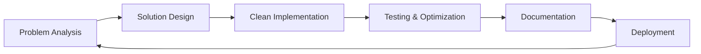

# 👨‍💻 mouad-ou

<div align="center">
  
</div>

## 🎯 Developer Profile

```python
class Mouad_Ou:
    def __init__(self): 
        self.role = "Full-Stack Developer"
        self.focus = ["Mobile Development", "Web Applications", "System Design"]
        self.experience = "Multi-platform Development"
        self.approach = "Clean Code, Efficient Solutions"
        
    def get_specializations(self):
        return [
            "Cross-platform mobile apps",
            "Management systems", 
            "UI/UX implementation",
            "Database design"
        ]
    
    def get_philosophy(self):
        return "Write code that works, optimize it to perfection 🎯"
```

## 🛠️ Technology Arsenal

<details>
<summary>📱 <strong>Mobile Development</strong></summary>
<br>


</details>

<details>
<summary>💻 <strong>Programming Languages</strong></summary>
<br>


</details>

<details>
<summary>🌐 <strong>Web Technologies</strong></summary>
<br>


</details>

<details>
<summary>🗄️ <strong>Database & Backend</strong></summary>
<br>


</details>

<details>
<summary>🔧 <strong>Development Tools</strong></summary>
<br>


</details>

---

## 🚀 Featured Project Portfolio

### 📱 **Smart Mobility Solution**
**Tech Stack:** `Flutter` `Dart` `Mobile Development`
- Cross-platform mobile application for urban transportation
- Real-time tracking and route optimization
- User-friendly interface with smooth animations

### 🎮 **Strategic Gaming Platform**
**Tech Stack:** `C` `Game Logic` `Algorithm Design`  
- Classic strategy game implementation
- Advanced AI opponent algorithms
- Multiplayer networking capabilities

### 📚 **Digital Library System**
**Tech Stack:** `Python` `Database Design` `System Architecture`
- Comprehensive library management solution
- Book tracking and user management
- Advanced search and categorization features

### 🏦 **Financial Management System**
**Tech Stack:** `Java` `OOP` `Security`
- Secure banking application architecture
- Transaction processing and account management
- Data encryption and security protocols

### 🏨 **Hospitality Management Platform**
**Tech Stack:** `Java` `Enterprise Architecture` `Database`
- Complete hotel management solution
- Reservation system and guest services
- Staff scheduling and resource management

### 🎨 **Modern Dashboard Interface**
**Tech Stack:** `Bootstrap` `SCSS` `Responsive Design`
- Clean and intuitive admin dashboard
- Mobile-responsive design patterns
- Advanced UI/UX components

---

## 📈 Development Metrics

```diff
+ 🎯 6+ diverse projects across multiple domains
+ 📱 Cross-platform mobile development expertise
+ 🏗️ Enterprise-level system architecture
+ 🎮 Game development and algorithm optimization
+ 💼 Business application development
+ 🎨 Modern UI/UX implementation
+ 🔒 Security-focused development practices
```

---

## 🎯 Current Focus Areas

```javascript
const developmentRoadmap = {
    mobile: [
        "🚀 Advanced Flutter animations and UI",
        "📡 Real-time data synchronization",
        "🔧 Cross-platform optimization"
    ],
    
    backend: [
        "☁️ Cloud architecture patterns",
        "🔐 Advanced security implementations", 
        "📊 Scalable database design"
    ],
    
    frontend: [
        "⚡ Modern web frameworks",
        "🎨 Advanced CSS animations",
        "📱 Progressive web applications"
    ],
    
    architecture: [
        "🏗️ Microservices design patterns",
        "🔄 Event-driven architectures",
        "📈 Performance optimization"
    ]
};
```

---

## 🌟 Project Highlights

<div align="center">

### 💡 **Innovation in Every Line of Code**

| Domain | Technology | Complexity | Impact |
|--------|-----------|------------|---------|
| 🚲 **Smart Mobility** | Flutter, Dart | Advanced | High |
| 🎯 **Strategy Gaming** | C, Algorithms | Expert | Medium |
| 📚 **Library System** | Python, DB | Intermediate | High |
| 🏦 **Banking App** | Java, Security | Advanced | Critical |
| 🏨 **Hotel Management** | Java, Enterprise | Advanced | Business |
| 🎨 **UI Dashboard** | Bootstrap, SCSS | Intermediate | Design |

</div>

---

## 🔄 Continuous Learning Journey

<div align="center">



</div>

---

---

<div align="center">
  
### 💭 *"Code is poetry written in logic, crafted with passion."*


**Crafting digital solutions, one commit at a time! ⚡**

</div>

---

<div align="center">
  

[](https://github.com/mouad-ou)

</div>

---

<div align="center">
  
</div>
  